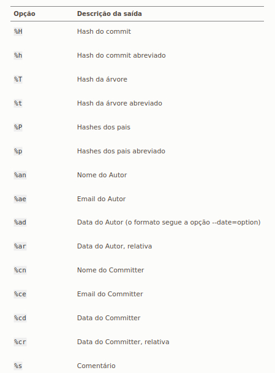
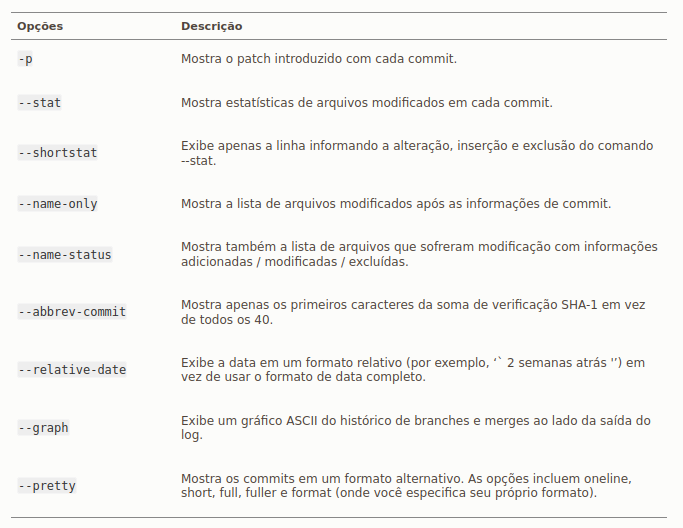
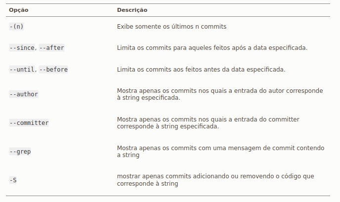

# Histórico de Commits

Agora com um repositório Git em mãos e já tendo feito vários commits é interessante que sejamos capazes de verificar o histórico de commits. Isso é verdade principalmente nos casos em que estamos trabalhando em conjunto com várias pessoas ou mesmo iniciando um trabalho em um projeto já em desenvolvimento a um tempo. Para isso o comando Git que devemos usar é o `git log`.

É interessante praticar os comandos aqui explicados com o seguinte repositório Git de exemplo: https://github.com/schacon/simplegit-progit.

## git log

Rodando apenas o comando `git log` o resultado será a listagem de todos os commits em ordem cronológica inversa, ou seja, o último commit aparece primeiro e assim em diante. As informações que aparecem sobre cada commit são as seguintes: O nome do autor e seu email, data, hora, a mensagem do commit e o hash do commit. 

## --graph

Se essa opção for adicionada ao comando `git log` o resultado será o mesmo só que agora serão mostrados o histórico dos ramos e também o histórico de merge.

## --pretty

Com esse opção podemos personalizar a saída do `git log`. Fazendo `--pretty=oneline` por exemplo a listagem dos commits apenas mostrará o hash do commit seguido da mensagem. As variações `short`, `full` e `fuller` seguem a mesma ideia do `oneline` só para mais ou para menos as informações mostradas de cada commit.

Já com a opção `format:""` é possível especificar o formato da saída do `git log`. Por exemplo: `git log --pretty=format:"%h - %an, %ar : %s"`. Com %h temos na listagem dos commits os seus respectivos hashes de forma abreviada, o %an é o nome do autor de cada commit, %ar data do commit e %s a mensagem do commit. Veja a tabela abaixo com todas as opções:

Fonte: https://git-scm.com

Outro detalhe importante é a diferença entre o autor do commit e o commiter. Essa distinção geralmente existe quando se trabalha com Git distribuído, o autor do commit é quem de fato escreveu o trabalho enquanto o commiter apenas submeteu alguma alteração. Assim uma nova funcionalidade tem um autor original e possíveis correções de bugs nessa nova funcionalidade terá um commiter. 

## -p

Com essa opção podemos visualizar o que foi introduzido em cada commit. Ela é particularmente útil para visualizar uma sequência curta de commits. Assim combinar ela com parâmetros numéricos para limitar o número de commits que queremos visualizar é muito bom. Por exemplo: `git log -p -2` irá mostrar apenas dois commits na ordem cronológica inversa com as informações padrão do `git log` e o que foi introduzido em cada commit.

Veja outras opções comuns abaixo:

## Limitando a saída do git log

Já foi visto que é possível limitar a saída do `git log` com parâmetros numéricos do tipo -\<n> em que n é o número de commits. Existem outras formas de fazer isso um exemplo é o parâmetro `--since` que permite listar commits a partir de datas. Por exemplo: `git log --since=2.weeks` lista os commits de hoje até duas semanas atrás.

Também é possível fazer a listagem de commits a partir de alguma critério de busca. Com a opção `--author` o critério de busca é o autor do commit, com a opção `--grep` o critério de busca serão palavras chaves buscadas nas mensagens dos commits. Para combinar vários critérios diferentes use a opção `--all-match`.

Veja mais opções de limitação abaixo:

Ir para: [Comandos Básicos Parte 3](comandos_basicos-3.md)
