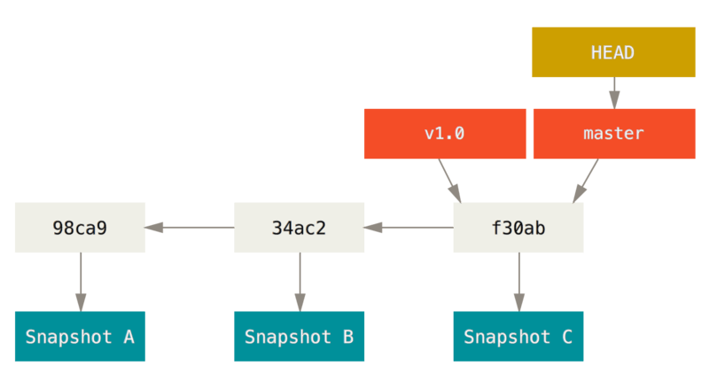

# Ramos

## Introdução

Criar um ramo para um projeto significa sair da linha de trabalho principal e começar a desenvolver em uma "outra" cópia do projeto. Possibilitando assim que se faça novas adições ou testes sem comprometer o que está sendo feito na linha principal. Em outros sistemas de versionamento fazer isso tem um custo muito alto pois é uma tarefa pesada, mas para o Git não.

A forma como o Git trabalha com ramos é um dos grandes diferenciais do Git e possibilita que todo o desenvolvimento de um projeto seja feito com ramos, coisa que era muito difícil com os outros versionadores.

## Funcionamento dos ramos

A forma como o Git trabalha com ramos está profundamente interligada com a forma com que ele armazena commits e os arquivos de um projeto. Cada commit é um objeto que possui um autor, data, mensagem mas principalmente possui uma *tree*. Uma tree é outro objeto que armazena a lista das versões de todos os arquivos e diretórios de um projeto, de determinado commit. Além de tree pode ser chamada também de *snapshot*. Cada versão de um arquivo ou diretório é chamada *blob*. Veja a imagem para entender melhor:

Além disso cada objeto commit contém ponteiros para os commits que vieram antes dele, no caso do commit raiz esse ponteiro não está definido, para um commit normal esse ponteiro aponta para o commit anterior e se for um commit resultante da mesclagem de ramos então ele aponta para vários commits. Assim o histórico de commits de um projeto se parece com isso:

### Ramo *master*

Um ramo nada mais é que um ponteiro que leva à um commit. Quando executamos `git init` automaticamente é criado o chamando ramo `master` que é o ramo principal do nosso projeto. Toda vez que fazemos um commit em algum ramo o ponteiro avança automaticamente para esse novo commit. No Git temos um ponteiro especial que aponta para algum ramo, esse ponteiro é chamado *HEAD*, e quando você troca de ramo na verdade o que acontece é que você está fazendo o HEAD apontar para outro ramo.

Assim a estrutura acima na verdade se parece com isso, quando levamos o ramo `master` e o HEAD em consideração:

### Criando novos ramos

Para criar novos ramos execute `git branch <nome_do_ramo>`, esse comando irá criar um novo ponteiro que leva ao commit que você está no momento, mas a partir do momento que você mover o HEAD para esse novo ramo e começar a commitar o ponteiro irá avançar automaticamente e irá passar a apontar para esses outros commits. Se executarmo por exemplo `git branch testing` teríamos algo assim na estrutura que estamos considerando:

### Trocando de ramo

Para trocar de ramo execute `git checkout <nome_do_ramo>`. Vamos supor que, na estrutura que estamos, eu troque de ramo e faça um novo commit. O que teríamos seria parecido com isso:

Se eu voltar para o ramo master e fizer um novo commit o ramo master também se moverá para frente, entretanto as duas novas adições (a que fiz no ramo master e a que fiz no ramo testing) estão completamente isoladas:

É a partir dessa noção que trabalharemos com ramos no Git daqui para frente.
